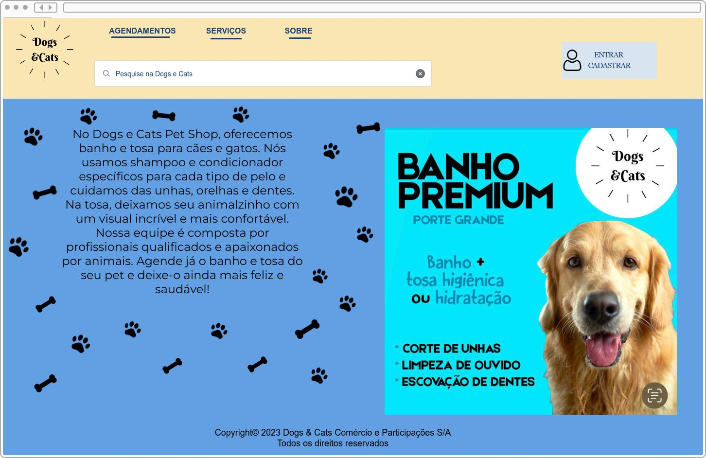
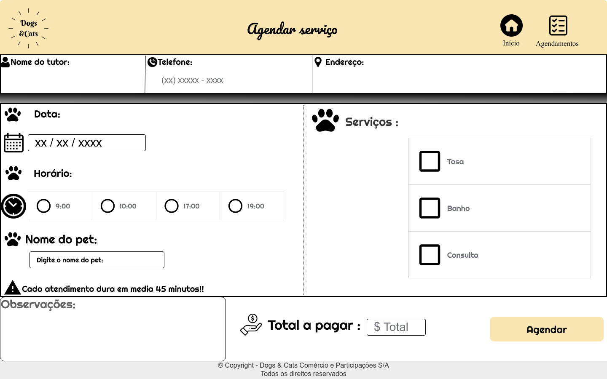
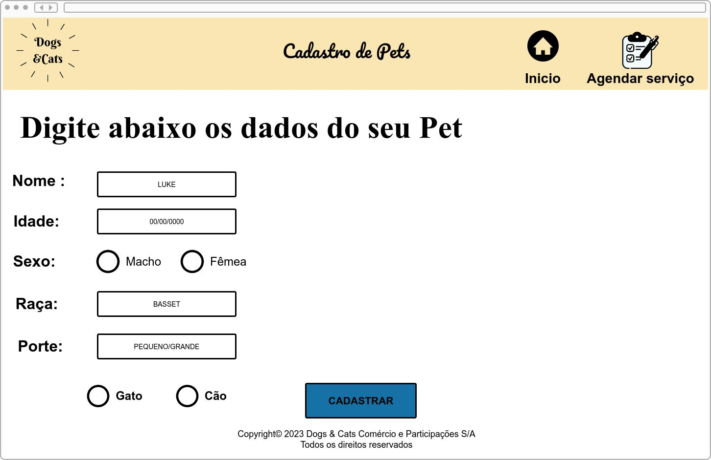

# Projeto de Interface
## User Flow

Após as telas de interface prontas, foi feito o user flow e o flow do administrador, para que um exemplo de interação com a aplicação seja visualizado.

Link do figma para melhor visualização: https://www.figma.com/file/VOldq5gSTP2cJRY0AWv9e8/User-Flow?node-id=0%3A1&t=40RQVmxS2qMHkxB2-1

Fluxo de usuário (User Flow) é uma técnica que permite ao desenvolvedor mapear todo fluxo de telas do site ou app. Essa técnica funciona para alinhar os caminhos e as possíveis ações que o usuário pode fazer junto com os membros de sua equipe.

## Wireframes

Após definição do esquema de cores, logo, e outros elementos de design, foram criados os protótipos das telas para exemplificar como serão as interfaces da aplicação web.

Aqui esta a interface Home da aplicação

Aqui está a interface que o usuario irá conseguir agendar seus serviços na aplicação.

Nesta interface ele conseguirá visualizar todos os seus agendamentos com a opção de excluí-los, caso necessario.

Aqui está a interface que o funcionário irá conseguir registrar os produtos.

Aqui está a interface que o funcionário irá conseguir gerenciar o estoque

Aqui está a interface que o funcionário irá conseguir registrar o serviço.

Aqui está a interface que o funcionário irá conseguir ver a listagem do serviço.

Aqui esta a interface Cadastro de Pets da aplicação

